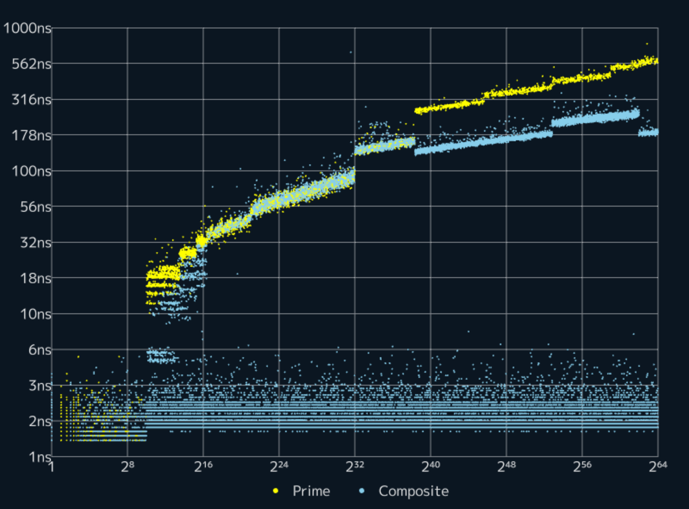

# libcpprime

**libcpprime** is a efficient C++ implementation of a primality test optimized for 64-bit integers.

# Usage

## <libcpprime/IsPrime.hpp>

### `cppr::IsPrime()`

```cpp
namespace cppr {
    bool IsPrime(std::uint64_t n) noexcept; // C++11
    constexpr bool IsPrime(std::uint64_t n) noexcept; // C++20
}
```

It returns true if the input value is a prime number; otherwise, it returns false.

#### example

```cpp
#include <libcpprime/IsPrime.hpp>
#include <cassert>
int main() {
    assert(cppr::IsPrime(998244353) == true);
    assert(cppr::IsPrime(999988224444335533) == false);
}
```

## <libcpprime/IsPrimeNoTable.hpp>

### `cppr::IsPrimeNoTable`

```cpp
namespace cppr {
    bool IsPrimeNoTable(std::uint64_t n) noexcept; // C++11
    constexpr bool IsPrimeNoTable(std::uint64_t n) noexcept; // C++20
}
```

It returns true if the input value is a prime number; otherwise, it returns false.
If you want to reduce the size of the executable file, use this function instead of `cppr::IsPrime` because `cppr::IsPrime` uses a 36KB table for performance optimization.

#### example

```cpp
#include <libcpprime/IsPrimeNoTable.hpp>
#include <cassert>
int main() {
    assert(cppr::IsPrimeNoTable(998244353) == true);
    assert(cppr::IsPrimeNoTable(999988224444335533) == false);
}
```

# Requirements

- C++11
- Any compiler that supports C++11

# Compilation

This library is header-only, so you only need to specify the include path.

```
g++ -I ./libcpprime -O3 Main.cpp
```

# Performance

### `cppr::IsPrime`


### `cppr::IsPrimeNoTable`



# Releases

- 2024/12/31 ver 1.2.7
  - Improve performance
- 2024/12/30 ver 1.2.6
  - Improve performance
- 2024/12/29 ver 1.2.5
  - Add copyrights notice
- 2024/12/28 ver 1.2.4
  - Improve performance
- 2024/12/26 ver 1.2.3
  - Improve performance
- 2024/12/25 ver 1.2.2
  - Improve performance
- 2024/12/23 ver 1.2.1
  - Improve performance
- 2024/12/19 ver 1.2.0
  - Split `cppr::IsPrime` into `cppr::IsPrime` and `cppr::IsPrimeNoTable`
- 2024/12/19 ver 1.1.2
  - Fix typo
- 2024/12/18 ver 1.1.1
  - Add include guards
- 2024/12/18 ver 1.1.0
  - Add `cppr::IsPrime` with a table
- 2024/12/18 ver 1.0.0
  - Add `cppr::IsPrime`
