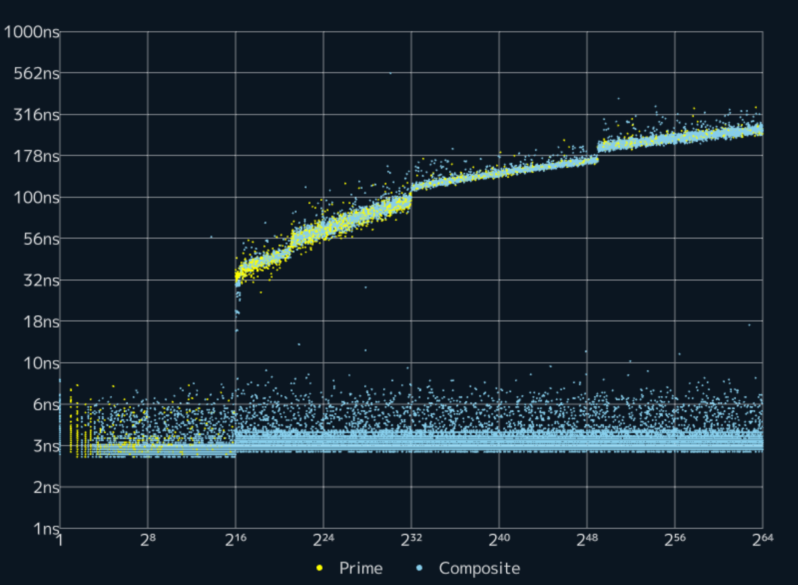

# libcpprime

**libcpprime** is a fast C++ implementation of a primality test optimized for 64-bit integers.

# Usage

```cpp
#include <libcpprime/IsPrime.hpp>
#include <cassert>
int main() {
    assert(cppr::IsPrime(998244353) == true);
    assert(cppr::IsPrime(999988224444335533) == false);
}
```

This library uses a 36KB table for performance optimization.
If you want to reduce the size of the executable file, define `LIBCPPRIME_NO_HUGE_TABLE` before including the library.

```cpp
#define LIBCPPRIME_NO_HUGE_TABLE // <==
#include <libcpprime/IsPrime.hpp>
#include <cassert>
int main() {
    assert(cppr::IsPrime(998244353) == true);
}
```

# Requirements

- C++11 (To use it as a constexpr function, C++20 is required.)
- gcc 4.7.1 or later
- clang 3.1.0 or later
- Any compiler that supports C++11

# Compilation

This library is header-only, so you only need to specify the include path.

```
g++ -I ./libcpprime -O3 Main.cpp
```

# Performance


If you define `LIBCPPRIME_NO_HUGE_TABLE`:


# Releases

- 2024/12/18 ver 1.0.0
- 2024/12/18 ver 1.1.0
